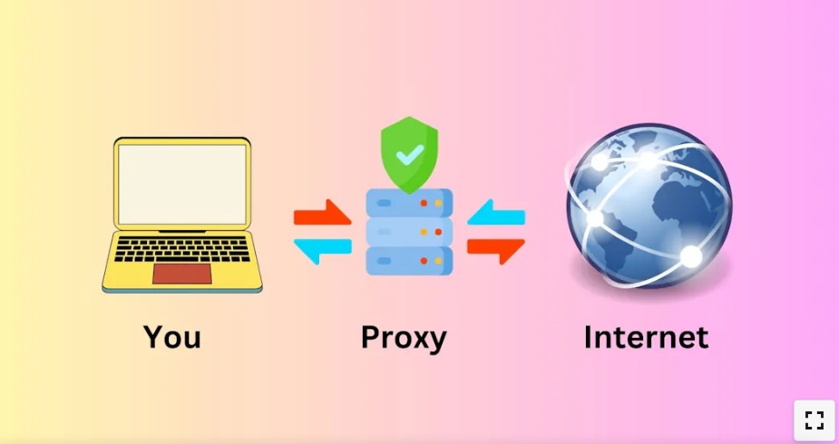

**Table of Contents** 

- [System Design Primer: The Ultimate Guide](#system-design-primer-the-ultimate-guide)
  - [Understanding System Design](#understanding-system-design)
  - [What is the Need for the System Design?](#what-is-the-need-for-the-system-design)
  - [Exploring Essential Design Methods in System Design](#exploring-essential-design-methods-in-system-design)
  - [Diving Deeper into System Design Concepts](#diving-deeper-into-system-design-concepts)
    - [Consistency Patterns:](#consistency-patterns)
    - [Availability Patterns:](#availability-patterns)
- [Advanced Concepts in System Design](#advanced-concepts-in-system-design)
- [Components of System Design](#components-of-system-design)
  - [Approaching System Design Interview Questions](#approaching-system-design-interview-questions)
    - [Step-by-step Guide:](#step-by-step-guide)
  - [Sample System Design Interview Questions and Solutions](#sample-system-design-interview-questions-and-solutions)
  - [Next Steps: Resources for Further Learning](#next-steps-resources-for-further-learning)


# System Design Primer: The Ultimate Guide
Dive deep into system design with our System Design Primer ultimate guide. From beginners to experienced professionals, we've got resources to elevate your skills.

## Understanding System Design

System design is foundational in software engineering, encompassing the creation of software architecture, modules, and components. Tech giants such as Google, Microsoft, and Amazon incorporate system design interviews to assess candidates' ability to develop application architectures. Understanding system design concepts is crucial for building scalable and reliable software. This primer provides a comprehensive overview of system design, covering basic to advanced concepts, and offers tips and resources for preparing for system design interviews.


## What is the Need for the System Design?
You understood that system design is used to prepare the architecture of the software or application. Now, let's understand why it is necessary to design a system before starting to write code for the application.

Let's start with an example.
- As a software developer, when approached by business owners to build a software application, the initial step is to gather requirements, both functional and non-functional. Non-functional requirements, such as scalability and high availability, are crucial considerations.

- Once the requirements are understood, system design becomes paramount. Architecting the application according to these requirements is essential. Decisions such as choosing between SQL or NoSQL databases based on data needs are made. Additionally, ensuring scalability to handle increased traffic is vital.

- For instance, major companies like Google and Facebook employ distributed server architectures worldwide. By serving resources from the nearest server, they optimize application efficiency. This exemplifies a key aspect of system design.


## Exploring Essential Design Methods in System Design

System design encompasses diverse methods and techniques for crafting architecture, tailored to project needs. Developers select methods based on project requirements. Commonly used system design methods include:
1. **Architectural Design**: The foundation of system design, detailing infrastructure, model, view, components, and interactions. Encompasses client-server interaction, microservices, etc.

2. **ERD Diagram (Entity-Relationship Diagram)**: Utilized for designing the database structure. Defines schemas, entities within each schema, attributes, and relationships between entities.

3. **UML Diagram (Unified Modeling Language)**: Used for modeling software systems. Includes various diagrams like activity, class, and sequence diagrams, representing different system aspects.

4. **Class Diagrams**: Depict classes along with their attributes, methods, and relationships. Offers an overview of the system's data and functionality.

5. **Sequence Diagrams**: Illustrate interactions among system components, modeling system behavior. Specifies processes like user input handling, data processing, and response generation.


## Diving Deeper into System Design Concepts
Here, I've covered the basics and fundamental concepts of the system design. Let's look at each concept one by one.


1. **Performance vs Scalability**:
   - **Performance**: Refers to the speed at which a website or application loads and serves resources. Slow loading times can deter visitors, so mechanisms like caching are employed to enhance performance.
   - **Scalability**: Denotes the ability of an application to handle increased traffic. Scaling can be achieved by distributing load across multiple servers or enhancing the capacity of a single server. Companies like Google utilize distributed data centers for scalability.

2. **Latency vs Throughput**:
   - **Latency**: Measures the time delay for completing a single request or data operation. Crucial for seamless user experiences in online gaming, live streaming, etc. Lower latency is preferred for optimal performance.
   - **Throughput**: Indicates the number of operations a system can handle within a specific time or the amount of data transferred per unit time. Used to assess system capability, and low throughput may necessitate server scaling.

3. **Consistency Patterns and Availability  Patterns**:
   - **Consistency**: Ensures that all nodes in the system read the same data simultaneously. For instance, in banking systems, consistent deduction of withdrawn amounts from the total balance is vital for accurate transactions.
   - **Availability**: Ensures that each request receives a response, whether with fresh or cached data. Crucial for maintaining high uptime, availability ensures that users can access the system consistently, even during peak demand or server outages.

### Consistency Patterns:
- **Strong Consistency**: Ensures each request receives the most recent data through synchronized communication, prioritizing consistency over availability.
- **Eventual Consistency**: Resolves temporary inconsistencies over time, prioritizing availability over consistency.
- **Weak Consistency**: Users may receive fresh data after writing, emphasizing fast access. Suitable for applications like live streaming or video chat.


 ### Availability Patterns:
- **Load Balancing**: Distributes incoming requests across multiple servers to ensure high availability, known as load balancing.
- **Retry and Timeout Strategies**: Implements retry mechanisms to process requests periodically in case of system failure or unavailability. For instance, refreshing a webpage if no response is received.


# Advanced Concepts in System Design

Let’s explore some advanced concepts of the system design.

1. **CDN (Content Delivery Network)**:
   - Distributed server network spanning different geo-locations.
   - Delivers content like images and data from servers.
   - Enhances performance by decreasing latency and delivering resources faster.
   - Utilizes cached resources from nearest servers or fetches from origin server.

2. **DNS (Domain Name System)**:
   - Resolves domain names to IP addresses for website access.
   - Maps unique domain names (e.g., www.example.com) to unique IP addresses.
   - Enables users to access websites using domain names instead of IP addresses.

3. **Caching**:
   - Mechanism for faster resource delivery, acting as high-speed storage.
   - Intermediate layer between web application and data source.
   - Checks cache storage for requested data; retrieves from source if not cached.
   - Utilizes cookies in browsers for caching data.

4. **Proxies**: 
   - Also known simply as "proxy".
   - Sits between the client application and    the  internet.
    - Acts as an intermediary for client requests  to access internet resources.
    - Retrieves requested resources from the internet and sends them back to the client application.
   - Often used for caching to improve performance.
   - VPNs utilize proxy servers to access blocked resources, providing enhanced privacy and circumventing restrictions.

   


# Components of System Design
From microservices to communication protocols, let's delve into the foundational elements of system design.

1. **Microservices and Service Discovery**:
   - Microservices: Break down applications into independent, task-specific services.
   - Service Identification: Each microservice has a unique ID and name.
   - Dynamic Service Discovery: Enables microservices to locate and interact with other services dynamically within the network.

2. **Database Systems: RDBMS and NoSQL**:
   - RDBMS (Relational Database Management System): Stores structured data in table format, suitable for SQL databases.
     - Characteristics: Table format storage, vertical scalability, SQL query language.
   - NoSQL (Non-SQL) Database: Stores data in key-value pairs, ideal for unstructured data storage.
     - Characteristics: Key-value pair storage, horizontal scalability, faster access, supports frequent database changes.

3. **Communication Protocols**:
   - HTTP/HTTPS: Hypertext Transfer Protocol and its secure version, used for web-based communication.
   - TCP/IP: Transmission Control Protocol, utilized for internet communication (e.g., chatting applications).
   - UDP (User Datagram Protocol): Used for live streaming, video calls, tolerating data loss.
   - WebSockets: Enables bi-directional duplex communication between web applications.


## Approaching System Design Interview Questions

   Now, let’s focus on how to solve the system design questions with step by step approach.

### Step-by-step Guide:

1. **Requirements Clarification**:
   - Identify both functional and non-functional requirements.
   - Functional Requirements: User-interaction features like authentication, navigation, and payment services integration.
   - Non-functional Requirements: Improving application capabilities such as high availability, scalability, consistency, low latency, and high throughput.

2. **Estimation of Resources**:
   - Determine necessary resources for building the application.
   - Consider server resources based on expected daily or per-second request volume.
   - Decide database storage requirements.

3. **System Interface Definition**:
   - Design system interfaces, including API endpoints and expected functionalities.
   - Example: Define endpoints for a sample API.
   ```API
   sendNotification(userId, message, …);
   ```

4. **Defining Data Model**:
   - Select appropriate database type based on data structure:
     - Relational databases for structured data.
     - NoSQL databases like MongoDB for unstructured data.
     - Graph databases for many-to-many relationships in social media applications.

5. **High-level Design**:
   - Design high-level components step-by-step.
   - Establish connections between system components (e.g., server, database, client).
   - Address functional requirements.

6. **Detailed Design**:
   - Enhance design to meet non-functional requirements.
   - Analyze system for performance optimization:
     - Utilize caching for improved performance.
     - Implement load balancing for scalability.
     - Evaluate CDN usage for caching or rely on cookies.
     - Plan for failure handling, data distribution, and database replication.

7. **Identifying and Resolving Bottlenecks**:
   - Identify system bottlenecks and propose solutions:
     - Handle system failures.
     - Monitor system performance and issues.
     - Ensure sufficient database replicas for failure management.


## Sample System Design Interview Questions and Solutions
Let’s look at the below system design interview questions. So you can easily crack the interviews for your dream job.


1. **Designing a URL Shortening Service (Similar to TinyURL)**:
   - Requirements:
     - Shorten long URLs.
     - Redirect shortened URLs to original URLs.
     - Handle 500 requests per second and scale accordingly.
     - Delete expired URLs.
     - Track URL click counts.
   - Approach:
     - Use REST API for server communication.
     - Implement load balancing for handling 500 requests per second.
     - Utilize relational database for simplicity.
     - Design relational database table to map long URLs to short URLs.
     - Generate unique IDs for shortened URLs.
  
2. **Designing a Web Crawler**:
   - Approach:
     - Limit browser windows to prevent memory overload.
     - Dynamically navigate web pages and domains.
  
3. **Designing Facebook and Instagram**:
   - Requirements:
     - User signup/sign-in.
     - Post and short video publishing.
     - Followers/following, direct messaging.
     - Display latest and trending posts.
   - Approach:
     - Manage user relationships in the database.
     - Integrate chat features, potentially using third-party applications.
     - Implement authentication.
     - Algorithm for displaying trending/latest posts.
     - Database replication, data caching, and load balancing for scalability and fault tolerance.
  
4. **Designing API Rate Limiting**:
   - Approach:
     - Set maximum requests per second.
     - Handle concurrent requests.
     - Track requests using IP addresses from request headers.


## Next Steps: Resources for Further Learning

To continue preparing for system design interviews, consider these valuable resources:

1. **System Design Interview Roadmap** by Design Guru:
   - Comprehensive course covering fundamentals and advanced concepts.
   - Contains 59 chapters and 103 lessons.

2. **System Design Interview Survival Guide (2024)**:
   - Offers preparation strategies and practical tips for success.

3. **The Complete Guide to Ace the System Design Interview**:
   - Provides in-depth guidance on mastering system design interviews.

4. **Ace Your System Design Interview with 7 Must-Read Papers in 2024**:
   - Highlights essential research papers for deeper understanding.

**Additionally**:

- explore books and online resources to further enhance your knowledge and readiness for system design interviews. Keep learning and practicing to excel in your interviews!


   **END** **END** **END** 